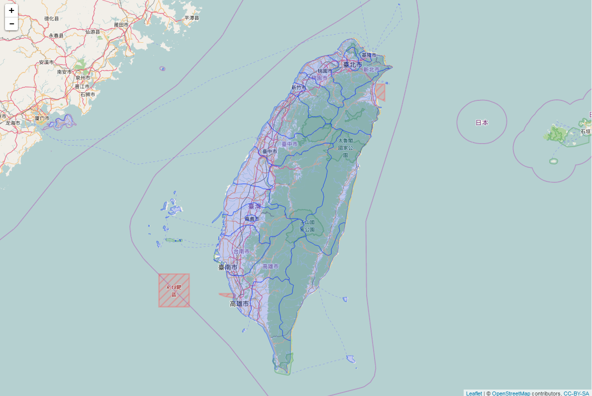
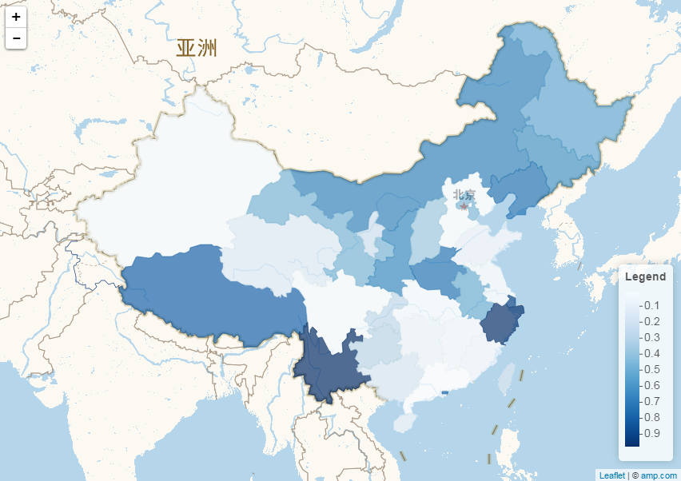
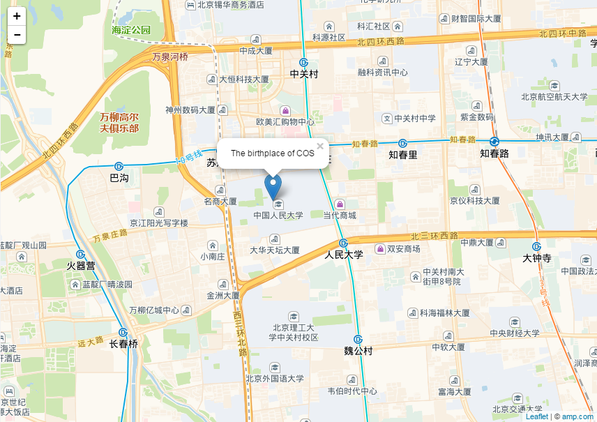

# leafletCN

[](https://cran.r-project.org/package=leafletCN)

[](https://ci.appveyor.com/project/lchiffon/leafletCN)


leafletCN是一个基于[leaflet](https://github.com/rstudio/leaflet)的中国扩展包, 里面保存了一些适用于中国的区域划分数据以及一些有帮助的函数, 地理区划数据来源于github的[geojson-map-china](https://github.com/longwosion/geojson-map-china)项目. 数据细分到县级市.

### 安装
```
## 稳定版
install.packages("leafletCN")
## 开发版
devtools::install_github("lchiffon/leafletCN")
```

### 常用的函数

- `regionNames` 返回某个地图的区域名
- `demomap` 传入地图名绘制示例地图
- `geojsonMap` 将一个分层颜色图绘制在一个实时地图上

其他辅助leaflet包使用的函数

- `amap` 在leaflet地图上叠加高德地图
- `read.geoShape` 读取一个geojson的对象,保存成spdataframe,以方便leaflet调用
- `leafletGeo`用地图名以及一个数据框创建一个sp的对象


### 基本使用

#### *regionNames*

传入需要查看的城市名, 显示这个城市支持的区域信息, 比如查看成都:
```
regionNames("成都")
[1] "成华区"   "崇州市"   "大邑县"   "都江堰市" "金牛区"  
[6] "金堂县"   "锦江区"   "龙泉驿区" "彭州市"   "蒲江县"  
[11] "青白江区" "青羊区"   "双流县"   "温江区"   "武侯区"  
[16] "新都区"   "新津县"   "邛崃市"   "郫县"    
```

如果不传入对象, 会自动返回300多个支持的名字列表,包括各个城市,省,以及三个特殊的名字:
1. `world`世界地图
2. `china`中国分省份地图
3. `city`中国分城市地图


#### *demomap*
传入城市名,显示这个城市的示例地图


```
demomap("台湾")
```

<iframe src="examples/demo1.html"></iframe>

#### *geojsonmap*
将一个数据框显示在需要展示的地图上.
在函数中做了一些有趣的设置, leafletCN会自动匹配传入的前两个字符来寻找合适的位置进行绘制,
所以基本不需要纠结是写'上海市'还是'上海'了

图做出来可以在上面点点点...

```
dat = data.frame(name = regionNames("china"),
                 value = runif(34))
geojsonMap(dat,"china")
```

<iframe src="examples/demo2.html"></iframe>

##### *geojsonmap* 的参数

- 还没开始写噗哈哈, 只写了帮助文档, 求PR

### 辅助函数

#### *amap*
叠加一个高德地图, 使用:
```
leaflet() %>%
  amap() %>%  
  addMarkers(lng=116.3125774825, lat=39.9707249401, popup="The birthplace of COS")
```


#### *read.geoShape*
`read.geoShape`这个函数可以把一个geojson格式的数据读取为一个`SpatialPolygonsDataFrame`对象, 方便sp或者leaflet包中的调用.

```
if(require(sp)){
  filePath = system.file("geojson/china.json",package = "leafletCN")
  map = read.geoShape(filePath)
  plot(map)
}
```


#### *leafletGeo*
`leafletGeo`这个函数可以把一个数据框和一个地图组合在一起, 方便用leaflet调用, 其中名字的
变量为`name`, 数值的变量为`value`~

```
if(require(leaflet)){
  dat = data.frame(regionNames("china"),
                                runif(34))
  map = leafletGeo("china", dat)

   pal <- colorNumeric(
     palette = "Blues",
     domain = map$value)

  leaflet(map) %>% addTiles() %>%
     addPolygons(stroke = TRUE,
     smoothFactor = 1,
     fillOpacity = 0.7,
     weight = 1,
     color = ~pal(value),
     popup = ~htmltools::htmlEscape(popup)
     ) %>%
   addLegend("bottomright", pal = pal, values = ~value,
                        title = "legendTitle",
                 labFormat = leaflet::labelFormat(prefix = ""),
                 opacity = 1)
}

```


#### 例子

[十行代码完成空气质量的可视化](http://langdawei.com/2017/01/07/aqi.html)
